---
## 
 F1C100S 

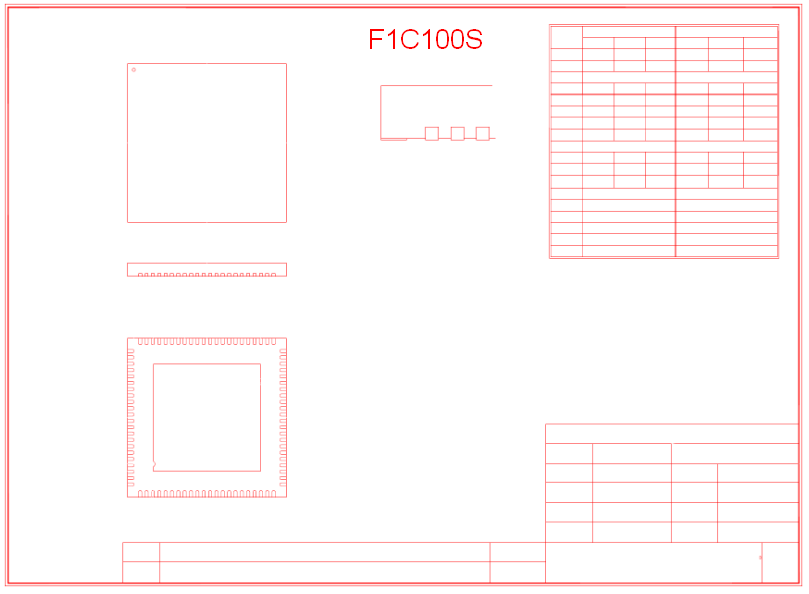

|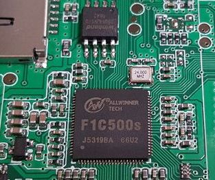|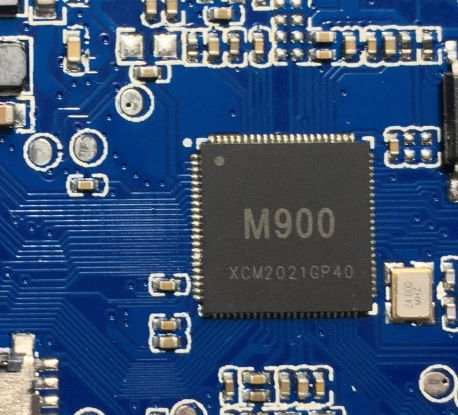||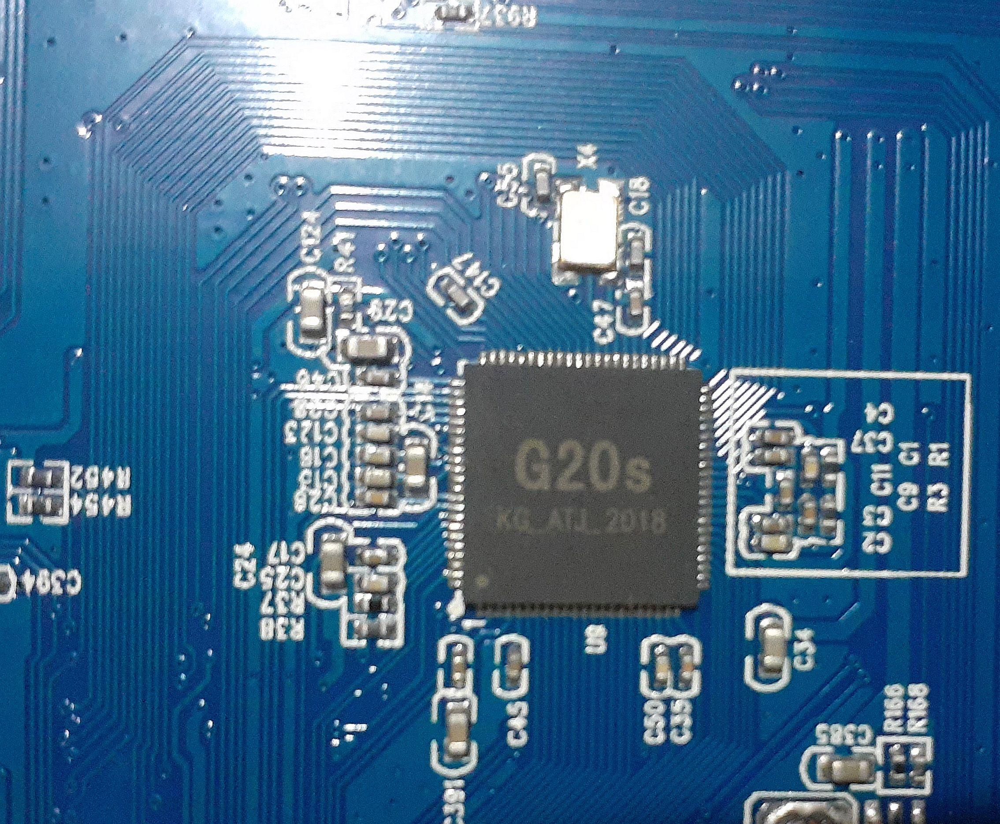||
|:---:|:---:|:---:|:---:|:---:|
|F1C500S|M900=FC100S|SUP M3 (F1C100S)|G20s=F1C100S|GB1=F1C100S|

---
## 
 F1E200 (NO support!) 

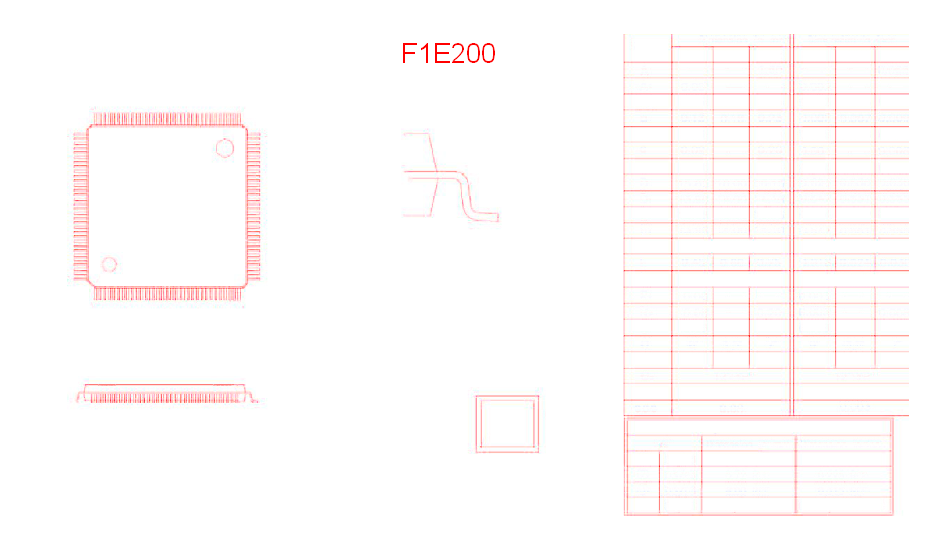

|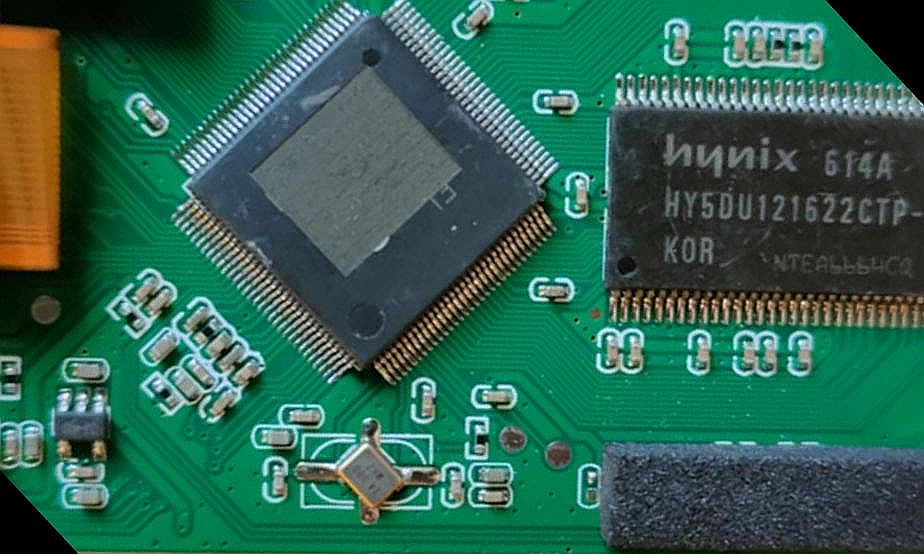|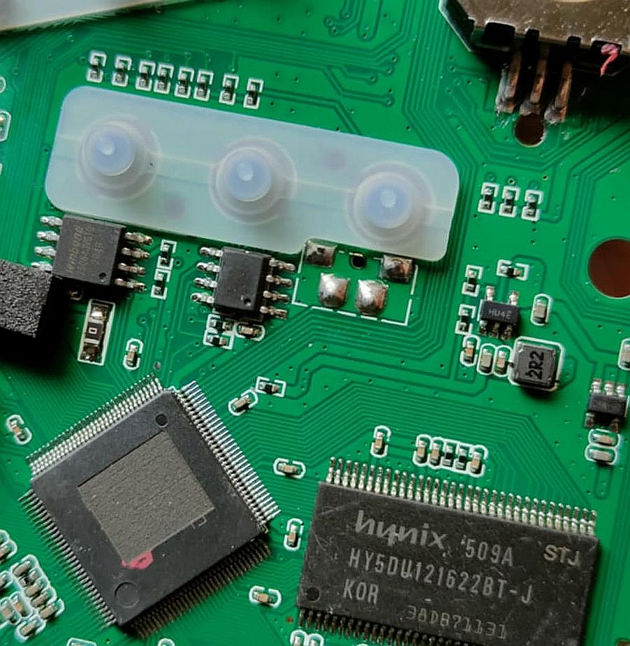|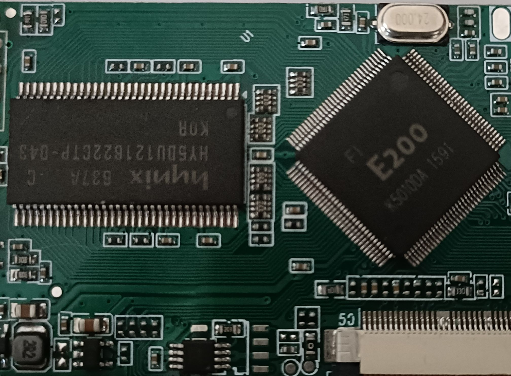|
|:---:|:---:|:---:|
|SUP M3 (F1E200) ex.1|SUP M3 (F1E200) ex.2|F1E200|

---
## 
 V100 (NO support!) 

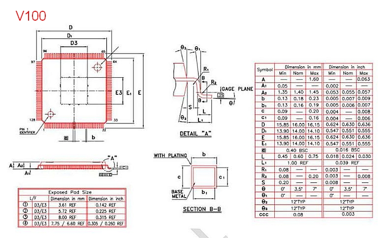

|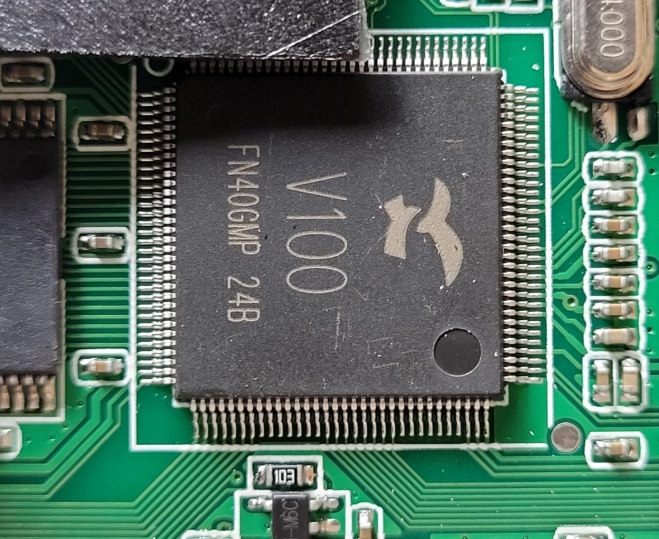|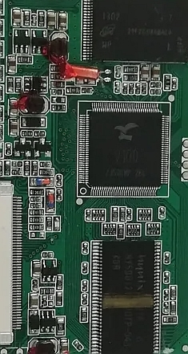|
|:---:|:---:|
|V100 ex.1|V100 ex.2|