# Version 1.3.3 - deprecated

---

The next guides are to install custom firmware **1.3.3** and below, download links are provide inside. If you need to take some stuff from older CFW file you may use this method [here](Custom-Firmware-Update.md).

If you don't know your console version you can take a look on the **console revision differences** [here](console-revisions-differences.md).

**Note:** Is highly recommended to not use the included SD card in the package due the bad quality of this causes data corruption in most of cases.

<details markdown="1">
<summary>Flashing on Mac</summary>

### Steps to flash an SD card:

1. Check the "/dev/disk" number of your SD card in Disk Utility.
2. Open the Terminal app
3. Unmount the card using this command in the Terminal: `diskutil unmountDisk "/dev/DISK"` (Where DISK is the disk# of your SD card.)
4. To write the disk image to the card: `sudo dd if="IMAGE.img" of="/dev/DISK"` (Where IMAGE is the full file path to the Miyoo CFW disk image you've downloaded, and DISK is the assigned disk# address of your SD card in Disk Utility.) You will need to enter your administrative password to confirm, and hit the Return/Enter key on your keyboard.

_**Warning:**_ Make sure that you enter the correct disk number for your SD card, or you will be overwriting a different card/disk on your computer!! Double-check the number in Disk Utility, or run the `diskutil list` command in the Terminal, and look for your card and its assigned number by the size of the disk.

Note: The disk# does **not** include the s# following it! The s# stands for sector (partition/volume) number in Mac OS. You need to write to the disk directly, not to a partition on the disk. If you write to a partition on the disk, you will need to re-flash, as the flashed SD card will not work/mount.

Note: When you hit Return/Enter on the above write command, dd/Terminal will appear to do nothing. This is normal. Wait until dd finishes its work, and it will give you a summary of the successful write. This may take quite some time, so be patient. If you hold down CTRL and press T on your keyboard, it will show you how dd is working.

**Steps to back up your whole SD card into a disk image file:**

1. Make sure you have enough space on your hard drive -- as much as the whole SD card is in size
2. Open the Terminal app
3. Unmount the card (see above)
4. Reverse the from/input ("if") and to/output ("of") values in the previous write command: `dd if="/dev/DISK" of="IMAGE.img"` (See what IMAGE and DISK stand for above.)
5. Wait until dd finishes and gives you the (successful) write summary

**Steps to expand the size of the "main" partition on the card:**

The easiest way to do this, if you have a CD/DVD drive, is to burn the GParted LiveCD ISO to an optical disc, and boot from it on your Mac by turning on the Mac and holding down the C key on your keyboard at the boot sound/chime.

When successful, you'll be greeted with an old-type, Windows-like blue/system screen. Just leave all the settings as default and hit the Return/Enter until it loads up GParted.

(Note: You'll likely need a wired mouse and keyboard for this, as your wireless/Bluetooth mice and keyboards will not work here! Paired, Bluetooth/wireless controllers don't work outside of the operating system.)

> You can download the GParted LiveCD ISO here: https://gparted.org/download.php
> Choose the "amd64" (64-bit) version, as all Intel Macs are 64-bit. (Only old PowerPC Macs are 32-bit.)

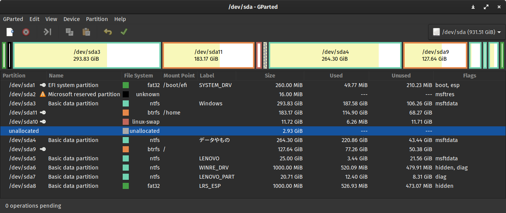

1. By default, GParted will load your Mac's hard drive first. Make sure you switch to your SD card using the top-right dropdown menu button!

2. Right-click the partition labelled "main" on your SD card, and choose the "Resize/Move" option.

3. In the resize window that pops up, drag the slider to the right, expanding the selection to the entire remaining space on the card, and hit the Resize (OK/confirm) button.

4. Now double-check that everything looks right (with only the "main" partition on the SD card expanded in size), and if everything looks correct, apply your changes by clicking the green tick button in the menu bar, or Edit > "Apply All Operations". You may need to confirm your changes -- check that they are correct and what you really want to do. At this point GParted will actually operate on your changed disk volumes and make the changes you've instructed it to make.

5. When done, close GParted and reboot your Mac. You've successfully resized your SD card, and your SD card is ready for use. Safely eject it from your Mac, and pop it into your Miyoo device.

---

</details>
# Pocket Go and PowKiddy Q90-V90-Q20

<details markdown="1"><summary>English Guide</summary>

---

[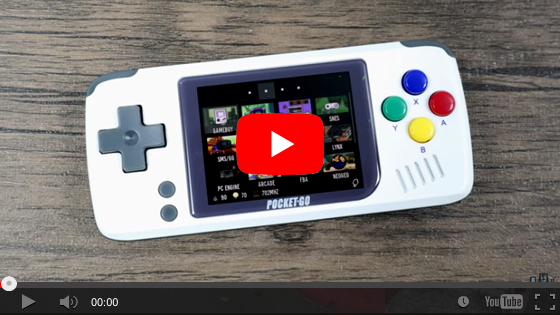](https://www.youtube.com/watch?v=YFdZEh4gAM8)
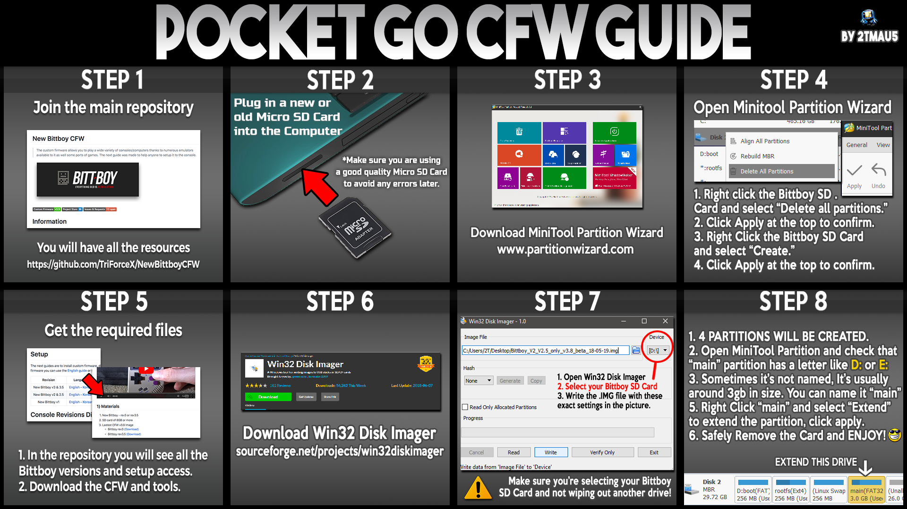

## 1) Materials

1. SD card of 8GB or more
2. Lastest Community CFW v1.3.3 Image
   - PocketGo / PowKiddy Q20 ([Download](https://github.com/TriForceX/MiyooCFW/releases/download/1.3.3/pocketgo-cfw-v1.3.3.7z))
   - PowKiddy Q90-V90 ([Download](https://github.com/TriForceX/MiyooCFW/releases/download/1.3.3/powkiddy-q90-v90-cfw-v1.3.3.7z))
3. Install Partition Wizard [(Download)](https://www.partitionwizard.com/download.html)
4. Install Win32DiskImager [(Download)](https://win32diskimager.org)
5. Install 7zip [(Download)](https://www.7-zip.org/download.html)
6. Optional Install SD Card Formatter [(Download)](https://www.sdcard.org/downloads/formatter)

## 2) Setup

1. You need to remove all partitions of SD card using: **Partition Wizard** or **SD Card Formatter**.
2. If the CFW file is compressed on **.7zip** just extract using **7zip** before proceed.
3. Execute **Win32DiskImager**, select SD card, load the **.IMG** file and press **Write** button to proceed.
4. Once the image is burned on the SD card, open **Partition Wizard** and choose **Disk Management**.
5. Then right click on the **"main"** partition and choose **extend** (Set it to the maximum) and apply.
6. Insert the SD into your console and turn it on. If it boots it is a success.

**Notes:** 
- The SD card need to be in **FAT 32** format.
- If you have problems to access the **"main"** partition on Windows 7 or 8 please read [here](https://github.com/TriForceX/MiyooCFW/wiki/Miyoo-CFW#alternative-to-access-the-main-partition-on-windows-7-or-8)

---
</details>


<details markdown="1"><summary>Korean Guide</summary>

---
	
[](https://www.youtube.com/watch?v=YFdZEh4gAM8)


## 1) 준비물

1. 8기가 이상의 SD카드
2. 최신 Community CFW v1.3.3 이미지
   - PocketGo / PowKiddy Q20 ([Download](https://github.com/TriForceX/MiyooCFW/releases/download/1.3.3/pocketgo-cfw-v1.3.3.7z))
   - PowKiddy Q90-V90 ([Download](https://github.com/TriForceX/MiyooCFW/releases/download/1.3.3/powkiddy-q90-v90-cfw-v1.3.3.7z))
3. Partition Wizard [(다운로드)](https://www.partitionwizard.com/download.html)
4. Win32diskimager [(다운로드)](https://win32diskimager.org)
5. 7zip [(다운로드)](https://www.7-zip.org/download.html)
6. 선택적 설치 SD Card Formatter [(다운로드)](https://www.sdcard.org/downloads/formatter)

## 2) 설치

1. **Partition Wizard** 또는 **SD Card Formatter** 를 사용하여 SD 카드의 모든 파티션을 제거해야합니다.
2. CFW 파일이 ** .7zip ** 압축 된 경우 진행하기 전에 _7zip_을 사용하여 압축을 풀면됩니다.
3. _win32diskimager_를 실행하고, SD 카드를 선택하고, **. IMG ** 파일을로드 한 다음 ** 쓰기 ** 버튼을 눌러 계속 진행하십시오.
4. 이미지가 SD 카드에 구워지면 파티션 마법사를 열고 디스크 관리를 선택하십시오.
5. _main_ 파티션을 마우스 오른쪽 단추로 클릭하고 extend (최대로 설정)를 선택하고 적용하십시오.
6. SD를 새 Bittboy에 넣고 켭니다. 부팅하면 성공합니다.

**노트:** 
- SD 카드는 _FAT 32_ 형식이어야합니다.
- Windows 7 또는 8의 "기본"파티션에 액세스하는 데 문제가있는 경우 [여기를 클릭하십시오](https://github.com/TriForceX/MiyooCFW/wiki/Miyoo-CFW#alternative-to-access-the-main-partition-on-windows-7-or-8)

---

</details>

# New BittBoy v3 and v3.5

<details markdown="1"><summary>English Guide</summary>

---

[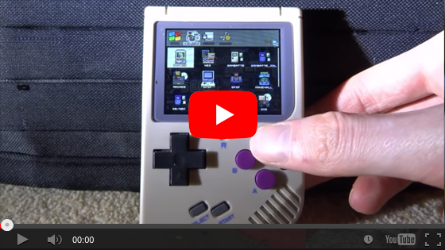](https://www.youtube.com/watch?v=cCNKwWwQIXI)
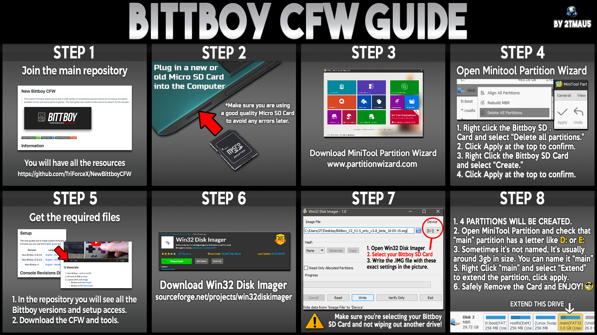

## 1) Materials

1. SD card of 8GB or more
2. Lastest Community CFW v1.3.3 Image
   - BittBoy rev3 ([Download](https://github.com/TriForceX/MiyooCFW/releases/download/1.3.3/bittboy-v3-cfw-v1.3.3.7z))
   - BittBoy rev3.5 ([Download](https://github.com/TriForceX/MiyooCFW/releases/download/1.3.3/bittboy-v3.5-cfw-v1.3.3.7z))
3. Install Partition Wizard [(Download)](https://www.partitionwizard.com/download.html)
4. Install win32diskimager [(Download)](https://win32diskimager.org)
5. Install 7zip [(Download)](https://www.7-zip.org/download.html)
6. Optional Install SD Card Formatter [(Download)](https://www.sdcard.org/downloads/formatter)

## 2) Setup

1. You need to remove all partitions of SD card using: **Partition Wizard** or **SD Card Formatter**.
2. If the CFW file is compressed on **.7zip** just extract using **7zip** before proceed.
3. Execute **Win32DiskImager**, select SD card, load the **.IMG** file and press **Write** button to proceed.
4. Once the image is burned on the SD card, open **Partition Wizard** and choose **Disk Management**.
5. Then right click on the **"main"** partition and choose **extend** (Set it to the maximum) and apply.
6. Insert the SD into your console and turn it on. If it boots it is a success.

**Notes:** 
- The SD card need to be in **FAT 32** format.
- If you have problems to access the **"main"** partition on Windows 7 or 8 please read [here](https://github.com/TriForceX/MiyooCFW/wiki/Miyoo-CFW#alternative-to-access-the-main-partition-on-windows-7-or-8)

---

</details>

<details markdown="1"><summary>Korean Guide</summary>

---

[](https://www.youtube.com/watch?v=cCNKwWwQIXI)


## 1) 준비물

1. 8기가 이상의 SD카드
2. 최신 Community CFW v1.3.3 이미지
   - BittBoy rev3 ([Download](https://github.com/TriForceX/MiyooCFW/releases/download/1.3.3/bittboy-v3-cfw-v1.3.3.7z))
   - BittBoy rev3.5 ([Download](https://github.com/TriForceX/MiyooCFW/releases/download/1.3.3/bittboy-v3.5-cfw-v1.3.3.7z))
3. Partition Wizard [(다운로드)](https://www.partitionwizard.com/download.html)
4. Win32diskimager [(다운로드)](https://win32diskimager.org)
5. 7zip [(다운로드)](https://www.7-zip.org/download.html)
6. 선택적 설치 SD Card Formatter [(다운로드)](https://www.sdcard.org/downloads/formatter)
	
## 2) 설치

1. **Partition Wizard** 또는 **SD Card Formatter** 를 사용하여 SD 카드의 모든 파티션을 제거해야합니다.
2. CFW 파일이 ** .7zip ** 압축 된 경우 진행하기 전에 _7zip_을 사용하여 압축을 풀면됩니다.
3. _win32diskimager_를 실행하고, SD 카드를 선택하고, **. IMG ** 파일을로드 한 다음 ** 쓰기 ** 버튼을 눌러 계속 진행하십시오.
4. 이미지가 SD 카드에 구워지면 파티션 마법사를 열고 디스크 관리를 선택하십시오.
5. _main_ 파티션을 마우스 오른쪽 단추로 클릭하고 extend (최대로 설정)를 선택하고 적용하십시오.
6. SD를 새 Bittboy에 넣고 켭니다. 부팅하면 성공합니다.

**노트:** 
- SD 카드는 _FAT 32_ 형식이어야합니다.
- Windows 7 또는 8의 "기본"파티션에 액세스하는 데 문제가있는 경우 [여기를 클릭하십시오](https://github.com/TriForceX/MiyooCFW/wiki/Miyoo-CFW#alternative-to-access-the-main-partition-on-windows-7-or-8)

---

</details>

# New BittBoy v2 and v2.5

<details markdown="1"><summary>English Guide</summary>

---

[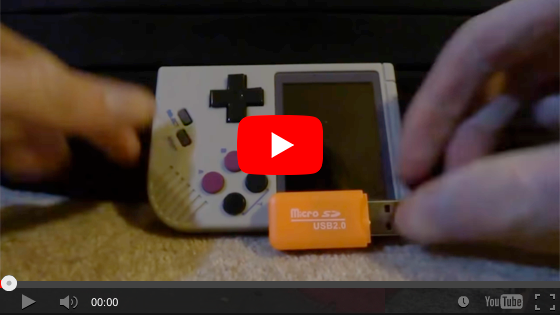](https://www.youtube.com/watch?v=i62_J6SAN9s)


## 1) Materials

1. SD card of 8GB or more
2. Lastest Community CFW v1.3.3 Image ([Download](https://github.com/TriForceX/MiyooCFW/releases/download/1.3.3/bittboy-v2-v2.5-cfw-v1.3.3.7z))
3. Install Partition Wizard [(Download)](https://www.partitionwizard.com/download.html)
4. Install win32diskimager [(Download)](https://win32diskimager.org)
5. Install 7zip [(Download)](https://www.7-zip.org/download.html)
6. Optional Install SD Card Formatter [(Download)](https://www.sdcard.org/downloads/formatter)

## 2) Setup

1. You need to remove all partitions of SD card using: **Partition Wizard** or **SD Card Formatter**.
2. If the CFW file is compressed on **.7zip** just extract using **7zip** before proceed.
3. Execute **Win32DiskImager**, select SD card, load the **.IMG** file and press **Write** button to proceed.
4. Once the image is burned on the SD card, open **Partition Wizard** and choose **Disk Management**.
5. Then right click on the **"main"** partition and choose **extend** (Set it to the maximum) and apply.
6. Insert the SD into your console and turn it on. If it boots it is a success.

**Notes:** 
- The SD card need to be in **FAT 32** format.
- If you have problems to access the **"main"** partition on Windows 7 or 8 please read [here](https://github.com/TriForceX/MiyooCFW/wiki/Miyoo-CFW#alternative-to-access-the-main-partition-on-windows-7-or-8)

---

</details>

<details markdown="1"><summary>Korean Guide</summary>

---

[](https://www.youtube.com/watch?v=i62_J6SAN9s)


## 1) 준비물

1. 8기가 이상의 SD카드
2. 최신 Community CFW v1.3.3 이미지 ([Download](https://github.com/TriForceX/MiyooCFW/releases/download/1.3.3/bittboy-v2-v2.5-cfw-v1.3.3.7z))
3. Partition Wizard [(다운로드)](https://www.partitionwizard.com/download.html)
4. Win32diskimager [(다운로드)](https://win32diskimager.org)
5. 7zip [(다운로드)](https://www.7-zip.org/download.html)
6. 선택적 설치 SD Card Formatter [(다운로드)](https://www.sdcard.org/downloads/formatter)
	
## 2) 설치

1. **Partition Wizard** 또는 **SD Card Formatter** 를 사용하여 SD 카드의 모든 파티션을 제거해야합니다.
2. CFW 파일이 ** .7zip ** 압축 된 경우 진행하기 전에 _7zip_을 사용하여 압축을 풀면됩니다.
3. _win32diskimager_를 실행하고, SD 카드를 선택하고, **. IMG ** 파일을로드 한 다음 ** 쓰기 ** 버튼을 눌러 계속 진행하십시오.
4. 이미지가 SD 카드에 구워지면 파티션 마법사를 열고 디스크 관리를 선택하십시오.
5. _main_ 파티션을 마우스 오른쪽 단추로 클릭하고 extend (최대로 설정)를 선택하고 적용하십시오.
6. SD를 새 Bittboy에 넣고 켭니다. 부팅하면 성공합니다.

**노트:** 
- SD 카드는 _FAT 32_ 형식이어야합니다.
- Windows 7 또는 8의 "기본"파티션에 액세스하는 데 문제가있는 경우 [여기를 클릭하십시오](https://github.com/TriForceX/MiyooCFW/wiki/Miyoo-CFW#alternative-to-access-the-main-partition-on-windows-7-or-8)

---

</details>

# New BittBoy v1

<details markdown="1"><summary>English Guide</summary>

---

[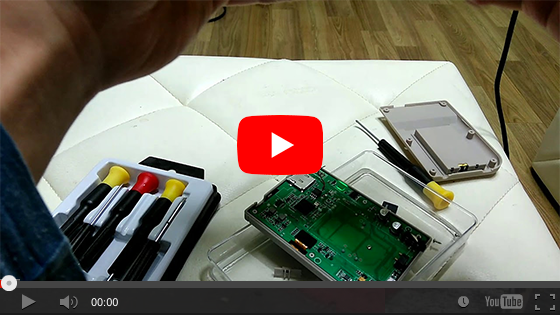](https://www.youtube.com/watch?v=FjQquL3W99U)

## 1) Materials
1. New Bittboy - rev1 (early version)
2. SD card of 8GB or more
3. Knapping supplies (ironing, silverware)
4. Jumper cable (thin cable recommended)
5. Debian or Ubuntu environment computer

## 2) Work Order
1. Hardware mode (hwmod)
2. Building SPI flashing environment
3. SPI flashing
3. Burn image to SD card

## 3.1) Hardware Mod (hwmod)
1. Unscrew the 6 screws to release the case.\
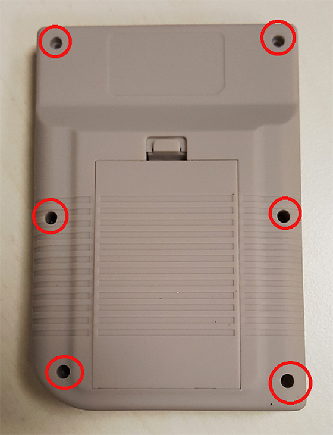
2. Check the display area. If the LCD connector is not on the display, it is Rev2.\
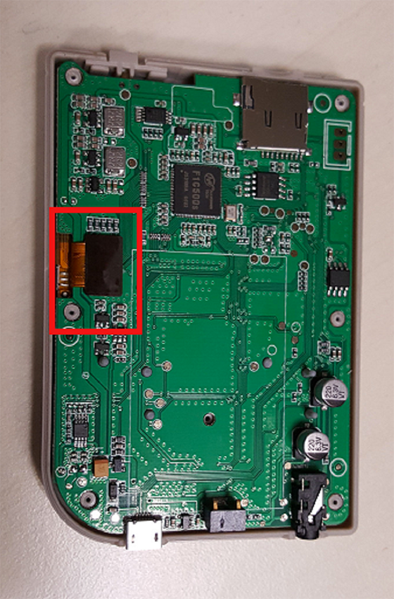
3. Remove resistors R75, R76, R78.
4. DM, DP solder joint (lead to ground).\
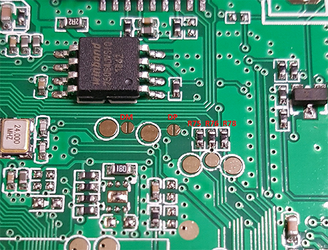
   - before work\
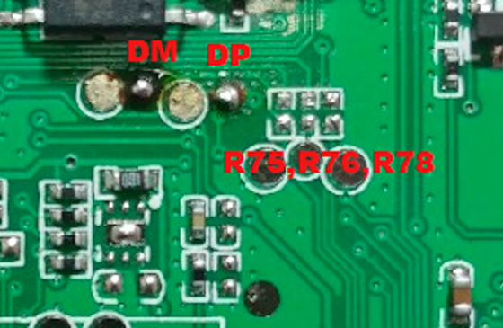
   - After work
5. Ground the jumper wire on the 2nd pin of the SPI IC chip.\
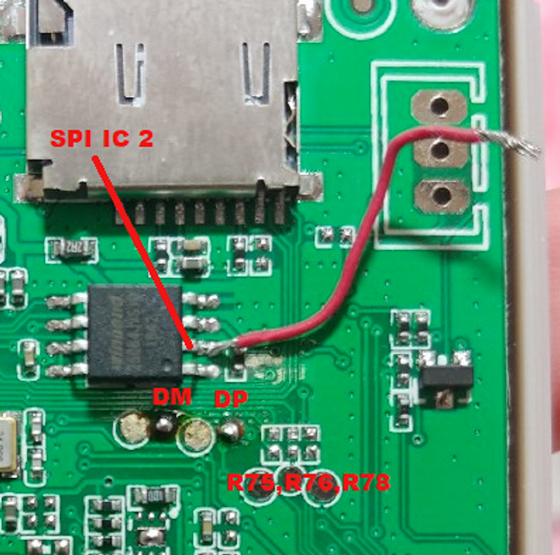

## 3.2) Building SPI Flashing Environment
1. Install Debian or Ubuntu on your PC.
2. Run the terminal using an account with root privileges.
3. Enter in the following order:
   ```
   sudo apt-get install git-core
   ```
4. When the installation is complete, type in the following order:
   ```
   git clone https://github.com/MiyooCFW/f1c100s_sunxi-tools
   cd f1c100s_sunxi-tools
   make clean && make
   ```
   **Note:** If says you have invalid permissions use `sudo make install`

## 3.3) SPI Flashing
1. Connect New BittBoy to PC with USB.
2. Turn on the power while holding the jumper wire as shown in the picture.
3. Download the latest spi image from Steward-fu's github. https://github.com/MiyooCFW/miyoo_rel
   ```
   SPI Image File Name Example > miyoo_spi_hwmod_1bit_ghostkey_20190216.bin
   ```
4. Move downloaded SPI image to home.
5. Run the terminal.
6. Type the following:
   ```
   sudo sunxi-fel -p spiflash-write 0 SPI image .bin
   ex> sudo ./sunxi-fel -p spiflash-write 0 miyoo_spi_hwmod_1bit_ghostkey_20190216.bin
   ```
7. Wait until 100% is completed.
8. Disconnect the New BittBoy from the PC and turn off the power.
9. Assemble the New Bittboy main body and turn on the power.
10. If the following screen is displayed, it is success.\
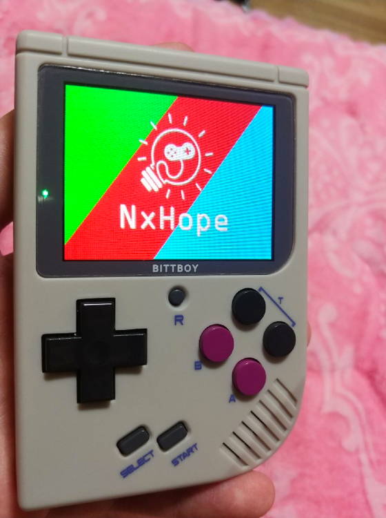

# 3.4) Burning an Image to an SD Card
1. Download the latest MiOS image from Steward-fu's github. https://github.com/MiyooCFW/miyoo_rel
   ```
   MiOS image file name example > MiOS_v1.0_20190203.zip, MiOS_v1.0_20190203.z01, MiOS_v1.0_20190203.z02 ...
   ```
   **Note:** You can get an alternative more updated image/kernel from Christian Haitian repository [here](https://github.com/christianhaitian/BittBoyV1).
2. Remove all partitions of SD card and format it with FAT32 etc. (I used Windows Disk Management)
3. Download `win32diskimager` and install it.
   https://win32diskimager.org/
4. Execute `win32diskimager`, select SD driver, load MiOS image and press **"Write"** button to proceed.\
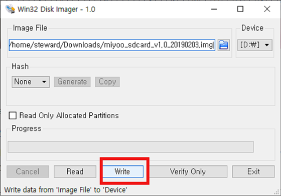
5. Once the image is burned, insert SD into New Bittboy and turn it on. If it boots like below, it is a success.\
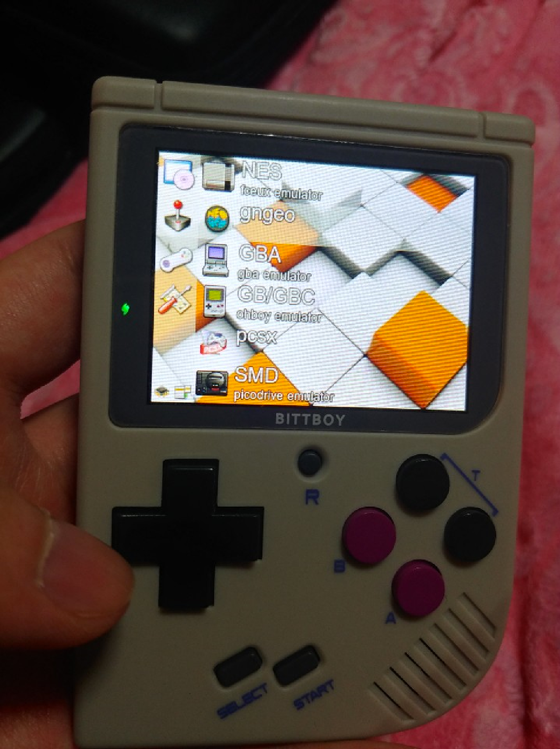

---

</details>

<details markdown="1"><summary>Korean Guide</summary>

---

[](https://www.youtube.com/watch?v=FjQquL3W99U)

## 1) 준비물
1. New Bittboy - rev1(초기 버전)
2. 8기가 이상의 SD카드
3. 납뗌 용품 (인두기, 은납)
4. 점퍼케이블(얇은 케이블 추천)
5. 데비안 or 우분투 환경의 컴퓨터

## 2)작업 순서
1. 하드웨어 모드(hwmod)
2. SPI플레싱 환경 구축
3. SPI플레싱
3. SD 카드에 이미지 굽기

## 3.1 하드웨어 모드(hwmod)
1. 나사를 풀어 케이스를 때어냅니다.\ 

2. 표시 부분을 확인합니다. LCD커넥터가 표시부분에 없다면, Rev2입니다.(간단히 구분방법)\

3. 저항 R75, R76, R78을 제거합니다.
4. DM, DP 솔더 조인트합니다.(납으로 접지합니다.)\

   - -수정전\

   - -수정후
5. SPI IC칩의 2번에 점퍼선을 접지합니다.\

 

## 3.2) SPI플레싱 환경 구축
1. PC에 데비안 or 우분투를 설치합니다.
2. root권한이 있는 계정으로 터미널을 실행합니다.
3. 다음과 같은 순서대로 입력합니다.
   ```
   sudo apt-get install git-core
   ```
4. 설치가 완료되면 다음과 같은 순서대로 입력합니다.
   ```
   git clone https://github.com/MiyooCFW/f1c100s_sunxi-tools
   cd f1c100s_sunxi-tools
   make clean && make
   ```
   **참고**: 잘못된 사용 권한이 있다고 표시되는 경우 `sudo make install`

## 3.3) SPI플레싱
1. USB로 뉴 비트보이(New Bittboy)와 PC를 연결합니다.
2. 사진과 같이 점퍼선을 접촉시킨 상태에서 전원을 켭니다.
3. Steward-fu의 github에서 최신 spi이미지를 다운로드 합니다. https://github.com/MiyooCFW/miyoo_rel
   ```
   SPI이미지 파일명 예시 >miyoo_spi_hwmod_1bit_ghostkey_20190216.bin
   ```
4. 다운받은 SPI이미지를 홈으로 이동합니다.
5. 터미널을 실행합니다.
6. 다음과 같이 입력합니다.
   ```
   sudo sunxi-fel -p spiflash-write 0 SPI이미지.bin
   ex>sudo sunxi-fel -p spiflash-write 0 miyoo_spi_hwmod_1bit_ghostkey_20190216.bin
   ```
7. 100% 완료될때까지 기다립니다.
8. 뉴 비트보이(New Bittboy)와 PC를 연결 해제하고 전원을 끕니다.
9. 뉴 비트보이(New Bittboy) 본체를 조립하고 전원을 킵니다.
10. 다음과 같은 화면이 출력되면 성공입니다.\


## 3.4) SD 카드에 이미지 굽기
1. Steward-fu의 github에서 최신 MiOS이미지를 다운로드 합니다. https://github.com/MiyooCFW/miyoo_rel
   ```
   MiOS이미지 파일명 예시 >MiOS_v1.0_20190203.zip, MiOS_v1.0_20190203.z01, MiOS_v1.0_20190203.z02 ...
   ```
   **참고**: Christian Haitian 저장소에서 대체 이미지 / 커널을 업데이트 할 수 있습니다 [여기에](https://github.com/christianhaitian/BittBoyV1).
2. SD카드의 파티션을 모두 제거하고 FAT32등으로 포맷합니다..(필자는 윈도우 디스크관리를 이용했습니다.)
3. `win32diskimager`를 다운받고 설치합니다. https://win32diskimager.org/
4. `win32diskimager`를 실행하고 SD드라이버를 선택 후 MiOS이미지를 불러온 후 "Write"버튼을 눌러 진행합니다.\

5. 이미지가 다 구워지면 뉴 비트보이(New Bittboy)에 SD를 삽입하고 전원을 킵니다. 아래와 같이 부팅되면 성공입니다.\


---

</details>