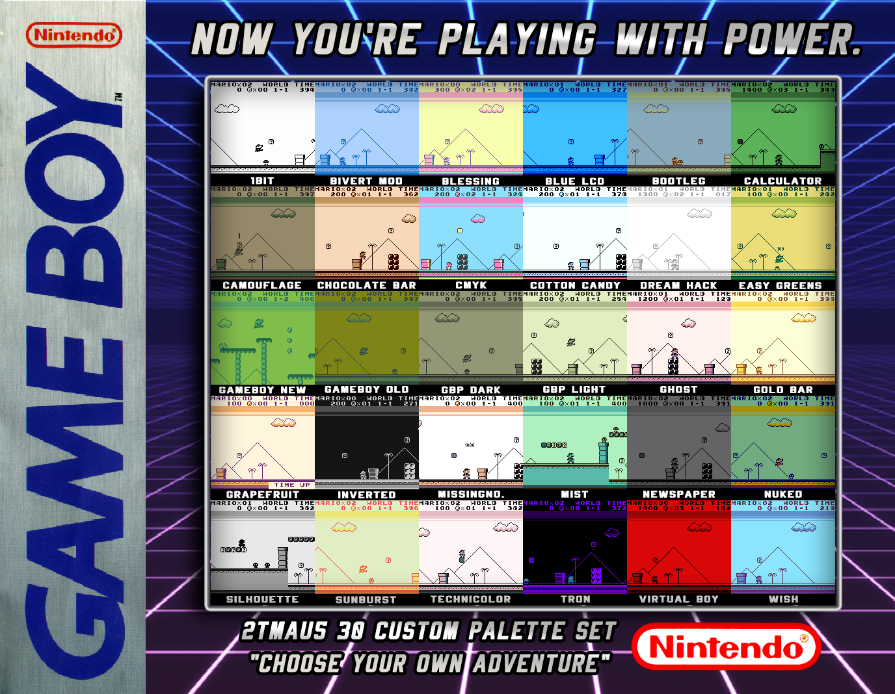

# About

The next list are some features _(pros/cons)_ of this emulator.

- Better Audio (Voice Samples, etc.)
- More Palettes (more than Ohboy)
- Better Border Support (no conversion)
- Can preview Borders, Filters, Palettes
- Scales to Borders
- Bilinear Filtering or Sharp Pixels
- Simpler UI
- Can easily preview Save/Load States
- Cheats support
- Boots Bios (authentic Gamboy boot up)
- Now with Two different Control Schemes
- Simulated Ghosting per device
- Less Screen tearing/ Better Framerate
- Mono audio only
- Colors are off (like Color Correction baked in)
- Missing 2 Scalers existing in ohBoy
- No GBA Enhanced Support (can hack it in tho)
- Only a few filters (needs conversion)

Thanks to **da1writer** for this list.

# Custom Palettes

This tutorial will help you install custom palettes for the bittboy emulator **GamBatte**. You can download here:
- Version 2 _(Lastest)_ [here](assets/2TMAU5_v2_Updated.zip)
- Version 1 _(Old)_ [here](assets/2TMAU5_Custom_Palettes_for_Gambatte.zip)

**Note:** If you already have the _version 1_ we highly recommend you to make a clean install and **DO NOT** copy over the old files. If you has favorites from the previous version just hold onto them to make sure it's in the new one.

**Notes**
1. _OhBoy_ and _GamBatte_ palettes arent interchangeable. You need the palettes for the correct emulator.
2. The .BMP Image Files are previews and can be added to the folder with out messing up the emulator.
3. If you dont have the said .ohboy or .gambatte folders you have to run the bittboy first so it creates the directory.
4. Alternatively on Windows you can open command prompt and type [mkdir .gambatte] This will create the folder in the `C:\Users\myuser\.gambatte`

**Auto Palette selection**
- The Gambatte emulator now (since version 20190621) supports automatic loading of palettes on a per-game basis 
  - This feature can be enabled from the gambatte settings menu (settings | mono palette | auto)
- The Palette file (.pal) in '.gambatte\palettes' with a filename matching the loaded ROM will be automatically used
  - EG for ROM 'gameA.gb', the palette file '.gambatte\palettes\gameA.pal' will be used
- Palette files used by original GBC/GBA consoles (when playing monochrome GB games) can be found in '.gambatte\palettes\GBC & SGB Palettes\GBC Assigned Palettes\'.
  - See 'GB on GBC Assigned Palette Guide.txt' in this same location for information on which games use which palette
  - Copy the desired palette to '.gambatte\palettes' and rename to match the game ROM

**How to install**
1. Plug in your Micro SD card to your Computer with the Bittboy CFW already installed.
2. Open the Main drive of the Micro SD card.
3. Create or find the .gambatte folder in the main drive.
4. Create or find the palettes folder in the .gambatte folder
5. Drag and drop all the .pal files into this folder.

**Directory**

`main/.gambatte/palettes/<.pal files>`

**Developer Notes**

This set of 30 custom palettes was made by **2TMAU5** so you can pick and choose what you like since there are preview images.
It also is intended to have all the palettes so it will be fun to choose from. Also included in another folder is **Hi-Ban** Sample Palettes, these were for the GCW port so I made preview images so you can choose what to include from there as well.

**Requests**

If you have any personal requests we can make a second pack. Just message **2TMAU5#9723** on Discord.