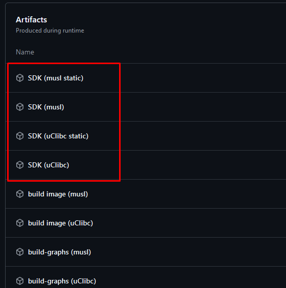

## Download the prebuilt toolchain from GH action artifacts

### Precondition
You have to be logged on GitHub

1. Go to https://github.com/MiyooCFW/buildroot/actions and select the latest action
2. From the artifacts section download SDKs



3. Once you have downloaded it, extract it

For e.g. uClibc SDK perform this steps:

```
gzip -d arm-miyoo-linux-uclibcgnueabi_sdk-buildroot.tar.gz
tar xvf arm-miyoo-linux-uclibcgnueabi_sdk-buildroot.tar
mv arm-miyoo-linux-uclibcgnueabi_sdk-buildroot miyoo
sudo cp -a miyoo /opt/
/opt/miyoo/relocate-sdk.sh
```

Your SDK is ready to use

The host binaries for cross-compilation will look like this:
```
arm-miyoo-linux-${LIBC}${EABI}-<binary>
```

$LIBC - your SDK libs' implementation in HOST machine (uclibc/musl)
$EABI - embedded-application binary interface (gnueabi/eabi)