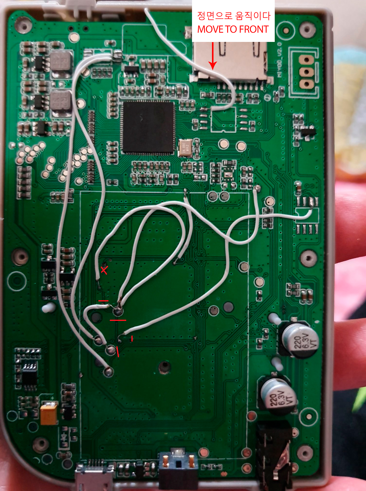
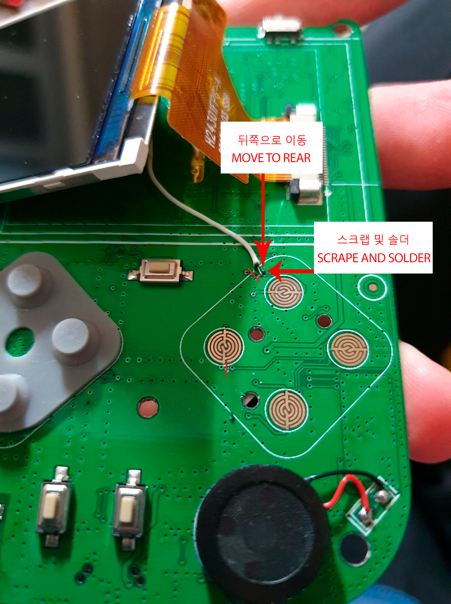
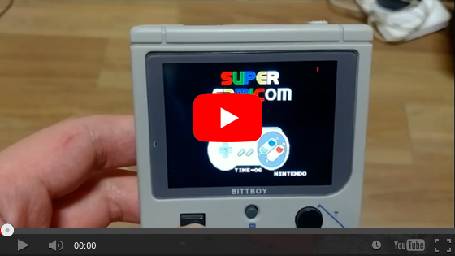

This operation requires soldering and was made to work on 2nd console revisions. One mistake can destroy the board forever. Only those who have knowledge of soldering are encouraged to work. Thanks to **Augen(히힛마스터)** for this guide.

**Warning:**\
The PCB v1 method of modification will operate normally immediately after booting, but soon the TA will be pressed.

## 1) Rear PCB (Cut red lines)

## 2) Front PCB (Cut red lines)

## 3) Operational Test

You can watch the proof of concept in the next video:

