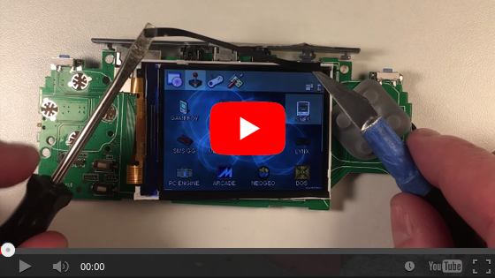

Bittboy and PocketGo has some serious light bleed from the top and side of the LCD screen. It can be fixed simply with some black electrical tape.

You need to cover the edges of the screen where the light can clean out. That's it!

Steps:

1. Disassemble the Pocket Go
2. Cut some thin strips of black electrical tape
3. Stick the strips directly to the LCD panel's glass and plastic frame around the edges, ONLY on the FRONT, not hanging over the sides of the frame
4. Also cover the ribbon cables on the left side of the screen (lightly, like a "flap" of tape that's attached to the LCD frame but just laying over the cables
5. Fit the LCD back into the front of the case
6. Reassemble and enjoy some games with no extra light!