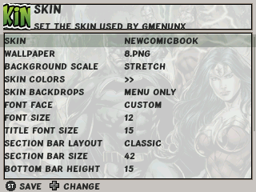
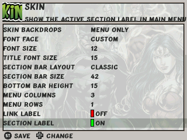

**New Comic Book** theme release v1.0

How to install (update)
- Download NewComicBook.7z [here](assets/NewComicBook.7z)
  - If upgrading remove previous versions from the apps/gmenu2x/skins/ folder
- Copy 'NewComicBook' folder from NewComicBook.7z archive must be copied to apps/gmenu2x/skins/ folder
- Go to the 'Skin' settings and use left/right to find and select 'NewComicBook' skin
- Go to the 'Skin' > 'Wallpaper' section and select one of 10 wallpapers you like the most
- Confirm your choice with 'Start' button

Have fun with a super-duper 'NewComicBook' theme!\
Thanks to Segich & SimplEasy for artwork

**Note:** Apply these settings below in skin settings

