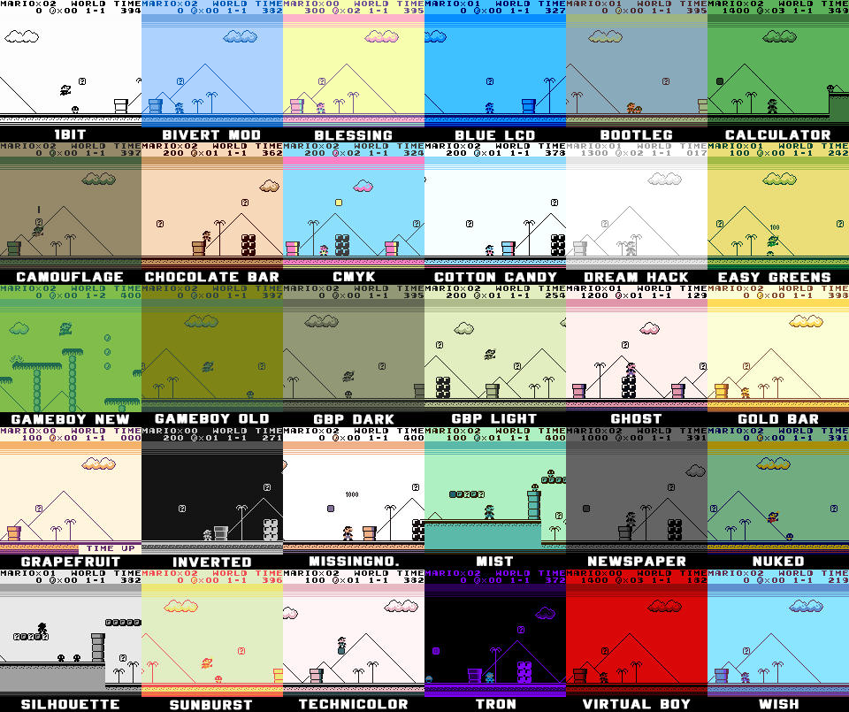

# About

The next list are some features _(pros/cons)_ of this emulator.

- Vivid/Bright Colors
- GBA Enhanced Mode 
- Can change between system type
- Highly configurable controls (quick save/load)
- Lots of Scalers (more than Gambatte)
- Lots of Filters (more than Gambatte)
- Borders have to be converted to work
- Not that many Palettes (needs conversion)
- UI is a bit small and convoluted with settings
- Can't preview Save/Load States
- Can't preview Borders, Filters, Palettes
- Stereo is supported but broken, out of sync
- No Bilinear Filtering
- No Cheats
- Simulated Ghosting can't be set per device
- Unstable Framerate/Screen Tearing
- Needs Frameskip 1 to clear up
- Can't Boot Bios 

Thanks to **da1writer** for this list.

# Custom Palettes

This tutorial will help you install custom palettes for the Bittboy emulator **OhBoy**. You can download [here](assets/2TMAU5_Custom_Palettes_for_Ohboy.zip)

**Notes**
1. _OhBoy_ and _GamBatte_ palettes arent interchangeable. You need the palettes for the correct emulator.
2. The .BMP Image Files are previews and can be added to the folder with out messing up the emulator.
3. If you dont have the said .ohboy or .gambatte folders you have to run the bittboy first so it creates the directory.
4. Alternatively on Windows you can open command prompt and type [mkdir .gambatte] This will create the folder in the `C:\Users\myuser\.ohboy`

**How to install**
1. Plug in your Micro SD card to your Computer with the Bittboy CFW already installed.
2. Open the Main drive of the Micro SD card.
3. Create or find the .ohboy folder in the main drive.
4. Create or find the palettes folder in the .ohboy folder
5. Drag and drop all the .pal files into this folder.

**Directory**

`main/.ohboy/palettes/<.pal files>`

**Developer Notes**

This set of 30 custom palettes was made by **2TMAU5** so you can pick and choose what you like since there are preview images. Thanks to **Finnbro** to convert them for _OhBoy_.
It also is intended to have all the palettes so it will be fun to choose from. Also included in another folder is **Hi-Ban** Sample Palettes, these were for the GCW port so I made preview images so you can choose what to include from there as well.

**Requests**

If you have any personal requests we can make a second pack. Just message **2TMAU5#9723** on Discord.