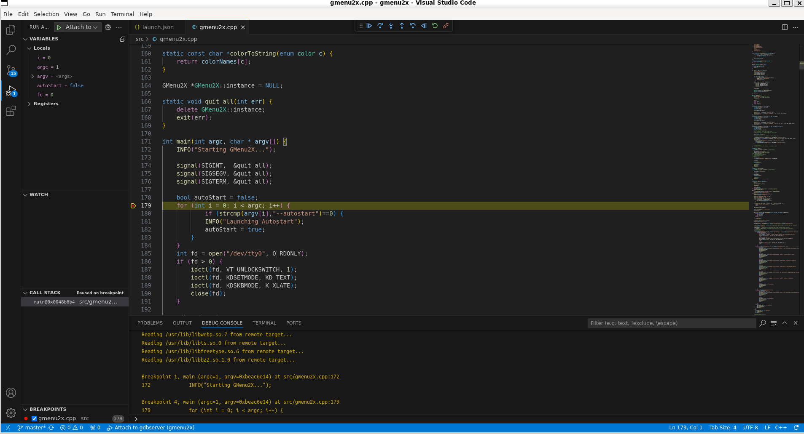

## How to run remote debugging on miyoo device using VS code and gdbserver

1. Install the [Native Debug](https://github.com/WebFreak001/code-debug) extension for VS Code
2. Add below launch configuration to Run configurations in VS Code (Run->Add Configuration..)

```
{
    "version": "0.2.0",
    "configurations": [
    
        {
            "type": "gdb",
            "request": "attach",
            "name": "Attach to gdbserver",
            "executable": "<path to binary relative to workspace root>",
            "target": "192.168.137.1:9999",
            "remote": true,
            "cwd": "${workspaceRoot}", 
            "gdbpath": "/opt/miyoo/usr/bin/arm-linux-gdb"
        }
    ]
}
```

You will need to correct "executable" and optionally "gdbpath" (if your SDK is on non-default path)

3. On miyoo device start gdbserver with application:

- via terminal

```
gdbserver 192.168.137.1:9999 ./<application>
```

- via gmenu2x gdbserver.lnk launcher:
```
title=gdbserver
exec=/usr/bin/gdbserver
params=192.168.137.1:9999
```

4. Start debugging in VS code (Run->Start Debugging)



