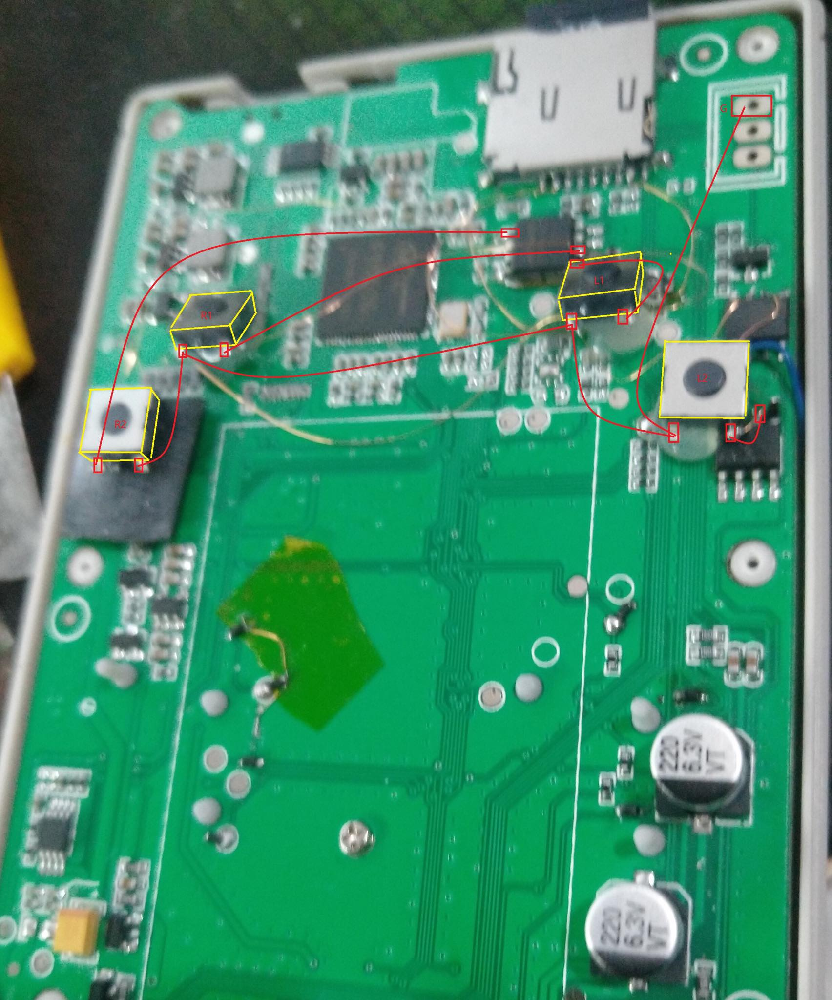
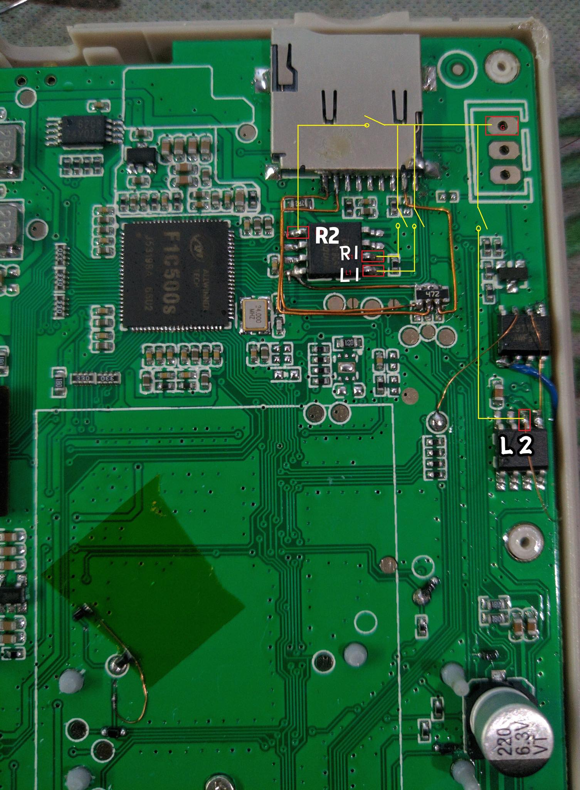
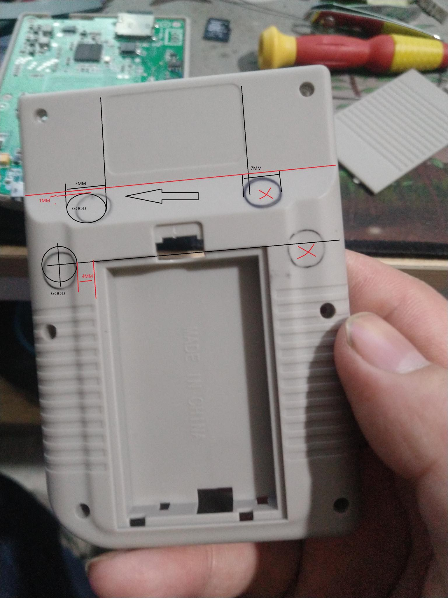
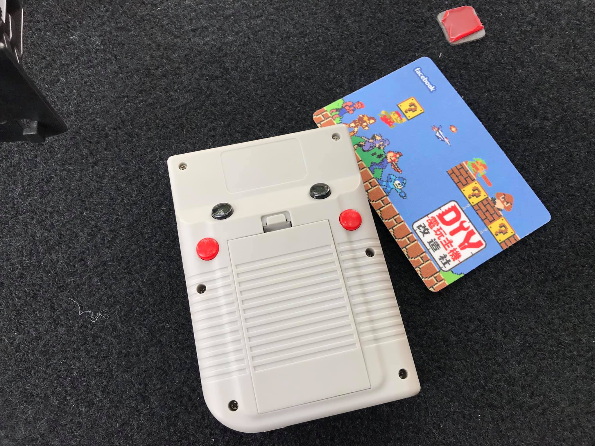

The next pictures shows how to add L1, R1, L2 and R2 to the 2nd revisions of the Bittboy. Thanks to **WenTao** for this.

**Warning:**\
This guide is under development, in some console revisions the L2 and R2 button may not work with some CFW versions.

## 1) Placing the buttons

## 2) Identify the connectors

## 3) Trim the case

## 4) Final product
