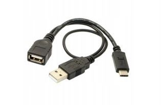

### Connect PC with USB tethering (for file transfer via FTP):

1. Connect to PC via USB
2. Start USB Network - This also starts DHCP server
3. Start FTP server and/or SSH server
4. Use FTP client [https://filezilla-project.org/](https://filezilla-project.org/) or other to transfer files via FTP
   * IP address: 192.168.137.1
   * Port: 22
   * user: root
   * password: root

***

For the below modes you need the USB OTG "Y" cable (male type C, see pic) to supply power from the charger to the external device since handheld doesn't provide it, as well for the USB bus to be active.

### Connect Android phone with USB tethering:

1. Start USB HOST mode
2. Connect Android phone (WARNING: need external power) and enable USB tethering
3. Start DHCP client app - to acquire IP address from android phone with enabled USB tethering
4. check the assigned IP in the show IP addr app

***

### Connect two handhelds with USB tethering:

1. Start USB HOST mode on the first handheld
2. Connect second handheld (WARNING: need external power)
3. Start DHCP client app - to acquire IP address from first handheld
4. check the assigned IP in the show IP addr app
