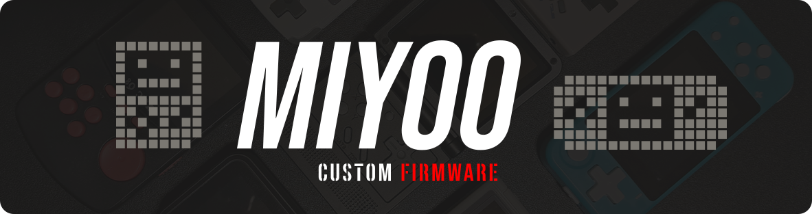
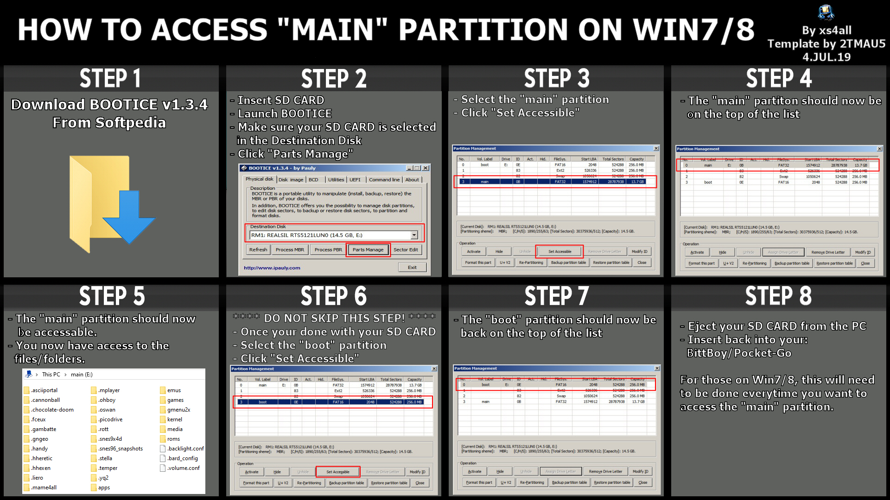

# Version 1.3.3

	<blockquote>
	The definitive custom firmware for <b>BittBoy</b>, <b>PocketGo</b>, <b>PowKiddy V90-Q90-Q20</b> allows you unlock the potential of the hardware and use software from a wide variety of consoles and computers thanks to the availability of numerous emulators and native ports of several games!
	</blockquote>

---

## Compatible Consoles

- BittBoy v1, v2, v2.5, v3, v3.5
- Pocket Go
- PowKiddy Q90
- PowKiddy V90
- PowKiddy Q20 Mini

---

# General Information

### SD Card

Is <b>highly</b> recommended to <b><u>NOT</u></b> use the SD card included in the package with the console or unbranded ones, it can be corrupted easily without reason due its bad quality. We recommend to use the common brands, 2GB minimum and class 10 for faster install process.

---

### Brightness workaround

If the console hotkeys for brightness doesn't work for some reason, you can try to edit _(with a text editor)_ and increase the number in the `.backlight.conf` file placed on the **main** partition of your SD card.

---

### Shutting down the console

- Not shutting down safely can cause micro SD corruption
- To safely shut down the console:
  - Exit from the emulator or game you are playing to return to the main menu (gmenu)
  - Hold the Start button to open the Power Menu
  - Press A to shut down
  - Alternatively you can go to the settings section and use the "Shutdown" icon or use the *Quick Shutdown Hotkey*
  - When the screen turns black, flick the power switch

---
 
### Screen timeout/sleep mode

This only applies while in the main menu:

- Pressing the R/Reset button will put the device into sleep/suspend mode
	- Press R/Reset again to wake it up
- The default screen timeout is 90 seconds, after this the screen will go black (the device will go to sleep)
- The default power timeout is 10 minutes, after the console has been idle for 10 minutes it will perform a soft shutdown
	- Once this has occurred, you must flick the power switch off and back on to wake the device

---

### Alternative to access the "main" partition on Windows 7 or 8

